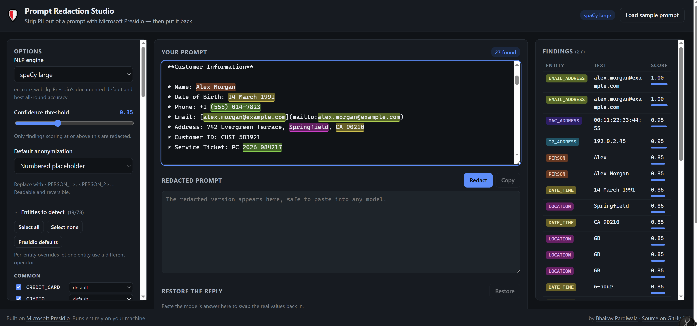
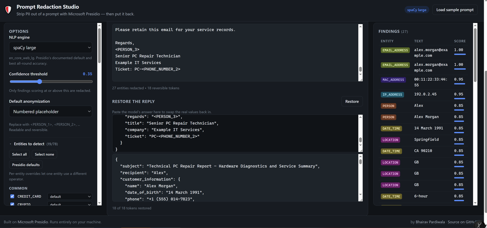
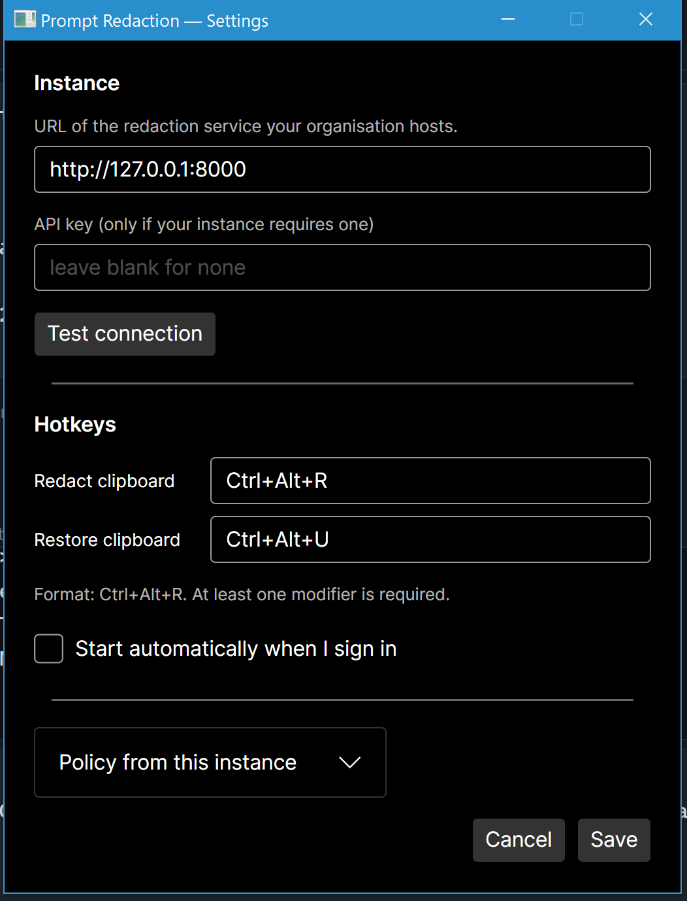

# Prompt Redaction Studio — full guide

Everything the [README](../README.md) leaves out: what each option does, how the restore
round trip works, how to deploy the desktop client across an organisation, and the API
reference.

- [What you can control](#what-you-can-control)
- [The restore round trip](#the-restore-round-trip)
- [Desktop app deployment](#desktop-app-deployment)
- [API](#api)
- [Layout](#layout)
- [Tests](#tests)

The options panel exposes Presidio's actual configuration surface — NLP engine, 78 entity
types, confidence threshold, seven anonymization operators, allow-lists and custom
recognizers — so you can see what each setting does to your text.



> All names, addresses, card numbers and IDs in the sample prompt, the tests and the
> screenshots are **synthetic**. `4111 1111 1111 1111` is the standard Visa test number,
> `example.com` and `192.0.2.x` are reserved for documentation, and the people and companies
> are invented. No real personal data is in this repository.

---

## What you can control

### NLP engine

Engines are built on first use and cached. An engine whose model isn't installed shows as
unavailable in the UI with the command to install it, rather than failing mid-request.

| Engine | Model | Notes |
|---|---|---|
| spaCy small | `en_core_web_sm` | ~12 MB, fastest. Misses more names and places. |
| spaCy large | `en_core_web_lg` | Presidio's documented default. Best all-round accuracy. |
| Transformers | `StanfordAIMI/stanford-deidentifier-base` | Highest recall, slowest. Opt-in. |

For the transformers engine on macOS or Linux:

```bash
pip install torch --index-url https://download.pytorch.org/whl/cpu
pip install "presidio-analyzer[transformers]"
```

On Windows, `.\setup.ps1 -WithTransformers` does the same.

### Anonymization operators

Chosen globally, or per entity type — set PERSON to `mask` while everything else uses
placeholders.

| Operator | What it does | Reversible |
|---|---|---|
| **Numbered placeholder** | `<PERSON_1>`, `<EMAIL_ADDRESS_1>`, … | **yes** |
| Replace | Fixed text, defaulting to `<ENTITY_TYPE>` | no |
| Redact | Deletes the value | no |
| Mask | `****@example.com` — configurable char, count, direction | no |
| Hash | SHA-256 or SHA-512 digest | no |
| Encrypt | AES with a 16/24/32-character key | **yes** |
| Keep | Detects but doesn't change the text | n/a |

**Numbered placeholder** is the default and is the one built for this job. It's the only
addition to Presidio's built-in set, implemented on Presidio's own `custom` operator: each
distinct value gets a stable numbered token, so a prompt mentioning the same person five
times stays internally consistent, and the model's reply stays readable enough to reason
about. Tokens are numbered in reading order.

Encryption is reversible too, but its base64 ciphertext reads as noise to a model and tends
to come back mangled — placeholders survive the round trip far more reliably.

### Detection settings

- **78 entity types**, grouped by region (Common, US, UK, India, Europe, Rest of world).
  The default selection is the 19 types Presidio itself loads out of the box; the country
  packs are one click away.
- **Confidence threshold** — a slider over `score_threshold`. Worth raising: with every
  entity type enabled and no threshold, short substrings can match low-scoring patterns
  (an email's local part scoring 0.01 as an Indian PAN, say).
- **Allow-list** — terms never redacted, with exact or fuzzy matching.
- **Custom recognizers** — your own entity types from a regex or a deny-list, passed as
  `ad_hoc_recognizers` so the shared engine is never mutated.
- **Detect ORGANIZATION** — Presidio suppresses `ORG` by default because it produces many
  false positives. This toggle makes that visible rather than mysterious.
- **Explanations** — `return_decision_process`, surfacing which recognizer fired, the
  pattern it matched, checksum results and context-word score boosts. Hover any row in the
  findings table.

---

## The restore round trip

1. Redact the prompt. Real values are swapped for tokens and a mapping is held server-side
   under a random session id.
2. Send the redacted prompt to any model.
3. Paste the reply into the restore box. Real values go back in.



Above, a model answered the redacted prompt with structured JSON that carried the tokens
through — `<PERSON_3>`, `PC-<PHONE_NUMBER_2>` — and all 18 came back. The model never saw a
real name, address or phone number.

Presidio's `DeanonymizeEngine` needs span offsets matching the text being restored — true
for the redacted prompt, but not for a model's reply, which is different text. Since the
reply is the case that matters, `restore()` locates each token in the incoming text first
and rebuilds the spans at those offsets before handing off to Presidio. Tokens the model
didn't repeat are reported as not-found rather than silently skipped.

### A note on the mapping

The token-to-original mapping is the key that undoes the redaction. It is kept **in memory
only**, keyed by a random session id, expires after an hour, and is never written to disk.
"Clear stored mappings" under Advanced drops them all immediately. Nothing in this app sends
your prompt anywhere — Presidio runs locally, and no LLM is called.

---

## Desktop app deployment

The web UI is fine for exploring options, but copy-pasting into a browser tab before every
prompt is friction nobody sustains. `tray/` is an Avalonia desktop client that removes it:
**copy text in any app → press Ctrl+Alt+R → paste redacted**, and **Ctrl+Alt+U** on the
model's reply to put the real values back.

### One person, one machine

If it is just you, `Start.cmd` (Windows) or `./start.sh` (macOS, Linux) is the whole
deployment. The launcher creates the virtualenv, installs the dependencies and models,
starts the server on `127.0.0.1:8000`, opens the browser, and offers to fetch the tray app
from the latest GitHub release — verifying it against the release's `SHA256SUMS`, since the
binaries are not code-signed. It remembers what it did in `.venv/.setup-stamp`, so the
second run skips straight to launching.

The tray app defaults to `http://127.0.0.1:8000`, which is exactly what the launcher
starts, so on the default port there is nothing to configure.

Its one requirement is network access to PyPI on the first run. Where that is blocked,
Docker is the way in.

### How it is meant to be deployed across an organisation

> **Deploying this to a team?** [**docs/ADMIN.md**](ADMIN.md) is the configuration
> guide for administrators: deployment modes, server variables, SSO behind a reverse
> proxy, identity provider registration, and fleet-deploying the desktop client with
> `managed.json`. This section is the overview.

Your organisation runs one instance of the server (the Docker image), and each employee
points the tray app at it. One client, many backends.



**Test connection** validates against the real instance before anything depends on it — a
wrong URL should fail here, visibly, rather than silently at the moment someone presses the
hotkey expecting to be protected.

Releases build automatically on tag push via `.github/workflows/release.yml`, with SHA-256
checksums and build provenance attestations attached.

> **Windows SmartScreen:** the published binaries are not code-signed, so Windows warns on
> first run and you must choose *More info → Run anyway*. In a managed rollout employees
> never see this, because IT redistributes the binary through its own deployment tooling.

### The client keeps the key, not the server

Every request the tray app makes passes `store_session: false`. The server analyses the
text, returns the redacted version **and the token mapping**, and retains nothing. The
mapping lives in memory in the client, expires after an hour, and is never written to disk.

That matters for a shared instance: no accumulating store of everyone's real values,
nothing for an unauthenticated `/api/restore` to hand back, and no session state to scale
across workers. Restoring is instant and needs no network call.

### Central policy

Clients fetch redaction settings from `GET /api/policy` rather than shipping their own
defaults, so redaction behaviour is an organisational decision rather than a per-employee
preference. Point `REDACTION_POLICY_FILE` at a YAML file to set it:

```yaml
locked: true
score_threshold: 0.4
entities: [PERSON, EMAIL_ADDRESS, PHONE_NUMBER, CREDIT_CARD, US_SSN]
default_operator:
  type: placeholder
per_entity_operators:
  CREDIT_CARD:
    type: hash
    params: { hash_type: sha256 }
allow_list: [Acme Corp]
```

Anything omitted keeps its default, so an instance with no policy file behaves exactly as
it always did.

### Authentication

Full configuration, including SSO, is in the
[administrator guide](ADMIN.md#server-configuration). In short:

By default there is none, and for one person on one laptop that is the right default —
nothing below applies until you set an environment variable on the **server**.

A shared instance sets one or both of these:

| Variable | Header | Guards |
|---|---|---|
| `REDACTION_API_KEY` | `X-Redaction-Key` | `/api/analyze`, `/api/redact`, `/api/restore`, `/api/policy`, `DELETE /api/sessions/{id}` |
| `REDACTION_ADMIN_KEY` | `X-Redaction-Admin-Key` | `POST /api/sessions/clear` |

`POST /api/sessions/clear` discards **every** client's mapping, so it is held separately
from everyday use. When `REDACTION_ADMIN_KEY` is unset it falls back to
`REDACTION_API_KEY`, so a single-key deployment does not leave a destructive route
unauthenticated; when it is set, the ordinary key no longer opens it.

`/api/health` and `/api/config` stay open. Health is what a load balancer probes, and it
reports no usage. Config carries the entity and operator inventory — identical in every
install — plus the `auth_required` flag the browser UI needs in order to know it should
ask you for a key. Neither returns a key or any prompt content.

It is an environment variable on the **server** process, wherever that runs:

```bash
docker run --rm -p 8000:8000 -e REDACTION_API_KEY="$REDACTION_API_KEY" \
  bhairavpardiwala/prompt-redaction-studio
```

```yaml
# docker-compose.yml — the values come from the environment or a .env file,
# so the keys themselves are never committed.
services:
  app:
    environment:
      REDACTION_API_KEY: ${REDACTION_API_KEY:?set REDACTION_API_KEY before composing up}
      REDACTION_ADMIN_KEY: ${REDACTION_ADMIN_KEY:-}
```

```powershell
$env:REDACTION_API_KEY = "..."    # then .\run.ps1, which inherits it
```

```bash
REDACTION_API_KEY=... uvicorn app.main:app --port 8000
```

The keys are read per request rather than at import, but a process cannot have its
environment changed from the outside — so in practice rotating a key means restarting the
server. Clients pick up a new key as soon as it is entered; no redaction already performed
is affected either way. The server logs one line at startup saying whether authentication
is on, and warns if a key is shorter than 32 characters. It never logs the key itself.

**The browser UI works with a key set.** When `/api/config` reports `auth_required`, the
page shows a small unlock field in the header. The key is held in `sessionStorage`, so it
is gone when the tab closes and is never written to disk. The desktop client has the same
field in Settings and sends the header on every request.

**`/docs` follows the key.** The interactive API docs are served on an instance with no
key — they are the local development affordance the README points at — and are off once
`REDACTION_API_KEY` is set, because a browser hitting `/docs` has no way to send the
header, and a shared instance should not advertise its whole surface to anonymous
callers. Set `REDACTION_ENABLE_DOCS=1` to force them on, or `=0` to force them off.

> **Use TLS.** Over plain HTTP the key, the prompt and the returned token mapping all
> travel in the clear, and a bearer key on a cleartext channel buys confidence without
> protection. Terminate TLS at a reverse proxy in front of the app.

> **A shared key is access control, not attribution.** It can prove a request was
> authorised. It can never say *who* made it, because every client sends the same secret.
> If you need to know which person redacted or restored what, that has to come from an
> authenticating reverse proxy in front of the app — oauth2-proxy, Entra Application
> Proxy, Cloudflare Access — passing an identity header.

### Troubleshooting

The app has no console, so it writes to `%APPDATA%\PromptRedactionTray\log.txt`: hotkey
registration, whether a hotkey matched, why a redaction failed, and any unhandled
exception. It records events only — never clipboard contents, never a token mapping.

If a redaction fails the clipboard is deliberately left untouched, rather than cleared or
half-processed.

If the tray icon is hidden in Windows' notification overflow and you cannot reach the menu,
start the app with `PRT_OPEN_SETTINGS=1` to open Settings directly.

---

## API

The UI is a thin client over a JSON API; every option above is available directly.
Interactive docs at `http://localhost:8000/docs` on instances with no API key set
(see [Authentication](#authentication)).

| Route | Purpose |
|---|---|
| `GET /api/config` | engines and availability, entity groups, operator specs, sample prompt |
| `GET /api/policy` | the redaction settings this instance wants clients to use |
| `POST /api/analyze` | detections only — type, offsets, score, explanation |
| `POST /api/redact` | analyze + anonymize — redacted text, token map, session id |
| `POST /api/restore` | put real values back into text containing tokens |
| `DELETE /api/sessions/{id}` | drop one mapping — what a client clearing its own redaction wants |
| `POST /api/sessions/clear` | drop **every** stored mapping, for every client (admin key) |
| `GET /api/health` | liveness, which engines are warm |

`POST /api/redact` accepts the full analyze request — `engine`, `entities`,
`score_threshold`, `allow_list`, `custom_recognizers`, `detect_organization`,
`return_explanations` — plus `default_operator`, `per_entity_operators` and
`store_session`. Pass `store_session: false` and the server keeps nothing: `session_id`
comes back `null`, but the full `mapping` is still returned so the caller can restore
locally. That is what the desktop client uses.

Findings come back with `entity_type`, `start`, `end`, `score`, `text`, the `recognizer`
that fired, and an `explanation` when you asked for one. Restore responses carry
`restored_text`, `tokens_restored` / `tokens_total`, a per-token `restored_counts`, and
`not_found` for tokens the model never repeated.

A worked round trip with real request and response bodies is in the
[README](../README.md#sample-run).

---

## Layout

```
Dockerfile        both spaCy models baked in; INCLUDE_LARGE_MODEL=false for a slim build
docker-compose.yml
Start.cmd         double-click entry point on Windows (.ps1 files cannot be)
start.ps1         one-step launcher: set up if needed, run, open the browser, offer the tray app
start.sh          the same for macOS and Linux
setup.ps1 / run.ps1   Windows convenience scripts, called by start.ps1
app/
  main.py         FastAPI routes, entity grouping, sample prompt
  engines.py      lazy cached engine registry; loads all 78 predefined recognizers
  operators.py    UI operator specs -> Presidio OperatorConfig; placeholder allocator
  recognizers.py  ad-hoc regex / deny-list recognizers
  redaction.py    analyze -> anonymize -> restore, plus the TTL session store
  policy.py       central IT-defined redaction policy, from REDACTION_POLICY_FILE
  schemas.py      pydantic request/response models
  static/         index.html, styles.css, app.js  (no build step)
tray/             Avalonia desktop client
  App.axaml.cs    tray icon, hotkey wiring, the redact and restore flows
  Services/       RedactionClient, MappingStore, HotkeyService, ClipboardService
  Views/          SettingsWindow, ToastWindow
tests/test_api.py 38 tests over the API
tray.Tests/       25 tests over the client logic
```

`AnalyzerEngine`'s default registry loads only ~17 recognizers (19 entity types).
Presidio ships many more as classes — the country packs for India, Germany, Korea, Spain
and others — which `engines.build_registry()` registers explicitly, taking coverage to 78
entity types.

---

## Tests

```powershell
.\.venv\Scripts\python.exe -m pytest tests\ -v     # 38 backend tests
dotnet test tray.Tests                             # 25 desktop client tests
```

On macOS or Linux, `python -m pytest tests/ -v` inside the activated venv.

The backend suite covers every operator, the placeholder round trip (including against a
reworded reply that reorders the tokens), encrypt/decrypt, custom recognizers, allow-lists,
thresholds, explanations, the stateless `store_session: false` path, policy loading, the
optional API key, and that malformed input returns a clean 4xx rather than a stack trace.

The client suite covers token restoration — repeated tokens, reordered replies, the
`<PERSON_10>` vs `<PERSON_1>` prefix trap, collisions between separate redactions, and TTL
expiry — plus hotkey parsing and matching.

`tray.Tests` also contains live tests that run against a real instance and skip themselves
when none is reachable. Set `REDACTION_TEST_REQUIRE=1` to make them fail instead of skip,
which is what you want in CI or when verifying by hand.
